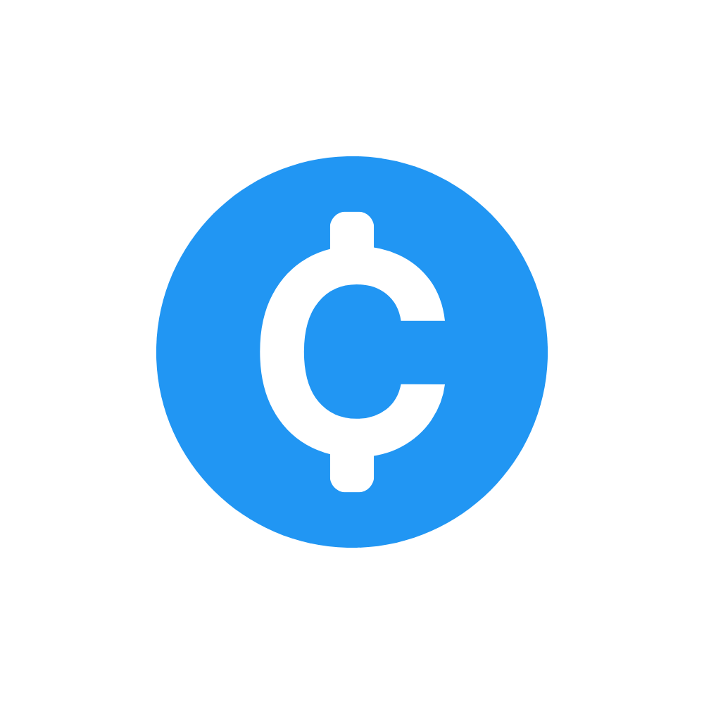

# C-Pon 💰


> *Your personal savings companion - Track goals, visualize progress, achieve dreams.*

---

## 📖 About
**C-Pon** is a mobile savings goal tracker designed to help users manage and achieve their financial goals effectively. Whether you're saving for a vacation, a new gadget, or building an emergency fund, C-Pon provides an intuitive interface to plan your savings journey.

This app was built to solve the challenge of **inconsistent saving habits** by breaking down large financial goals into manageable weekly or monthly contributions. It empowers users to visualize their progress and stay motivated.

---

## 🛠 Tech Stack
**Frontend:**
* [Flutter](https://flutter.dev/) - Cross-platform mobile framework
* [Dart](https://dart.dev/) - Programming language
* [Flutter ScreenUtil](https://pub.dev/packages/flutter_screenutil) - Responsive UI design
* [Lucide Icons](https://pub.dev/packages/lucide_icons_flutter) - Beautiful icon library

**State Management & Storage:**
* [SharedPreferences](https://pub.dev/packages/shared_preferences) - Local data persistence
* Provider pattern for state management

**Additional Tools:**
* [Intl](https://pub.dev/packages/intl) - Internationalization and date formatting

---

## ✨ Key Features
* **Smart Goal Planning:** Choose between two modes - calculate required savings based on a target date, or estimate completion time based on savings capacity.
* **Real-time Progress Tracking:** Visual progress bars and statistics showing how close you are to achieving each goal.
* **Flexible Savings Schedule:** Set weekly or monthly saving contributions tailored to your budget.
* **Insights Dashboard:** Analyze your savings patterns with detailed statistics and visual charts.
* **Multiple Sorting Options:** Organize goals by progress, date, amount, completion status, or name.
* **Beautiful UI/UX:** Clean, modern interface with smooth animations and responsive design.
* **Offline-First:** All data stored locally - no internet required.

---

## 🚀 Getting Started
Follow these steps to set up the project locally.

### Prerequisites
* [Flutter SDK](https://docs.flutter.dev/get-started/install) (3.8.1 or higher)
* [Dart SDK](https://dart.dev/get-dart) (included with Flutter)
* Android Studio / Xcode for emulators
* A code editor (VS Code or Android Studio recommended)

### Installation
1. Clone the repository
   ```sh
   git clone https://github.com/yourusername/cpon.git
   cd cpon
   ```

2. Install dependencies
   ```sh
   flutter pub get
   ```

3. Run the app
   ```sh
   flutter run
   ```

### Building for Production
**Android:**
```sh
flutter build apk --release
```

**iOS:**
```sh
flutter build ios --release
```

---

## 📁 Project Structure
```
lib/
├── main.dart                 # App entry point
├── models/
│   └── goal.dart            # Goal data model
└── screens/
    ├── home.dart            # Main dashboard
    ├── add_goal.dart        # Goal creation screen
    ├── insights.dart        # Analytics dashboard
    ├── main_screen.dart     # Bottom navigation
    ├── onboarding.dart      # User onboarding
    ├── tutorial.dart        # Feature tutorials
    └── welcome.dart         # Welcome screen
```

---

## 🎯 Future Enhancements
* Cloud sync across devices
* Goal categories and tags
* Expense tracking integration
* Push notifications for savings reminders
* Data export to CSV/PDF
* Dark mode support

---

## 📄 License
This project is licensed under the MIT License - see the LICENSE file for details.

---

*Built with ❤️ using Flutter*
